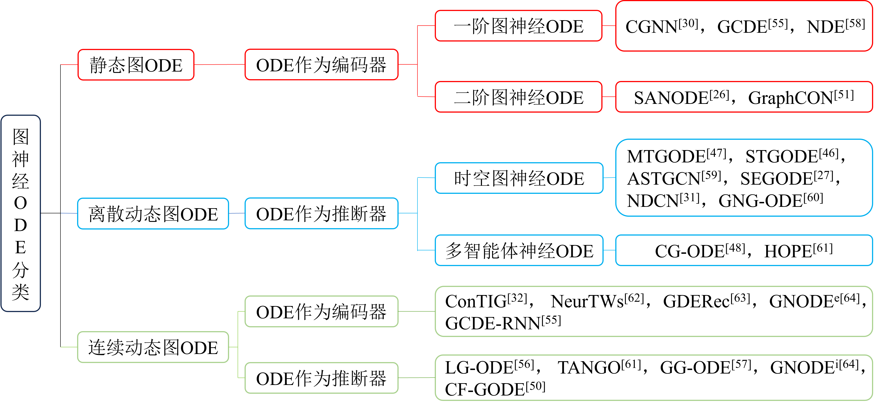

# 图神经常微分方程综述
&emsp;&emsp;本文根据静态图、离散动态图和连续动态图等不同类型图的特点，将相关工作分为静态图神经ODE、离散动态图神经ODE以及连续动态图神经ODE．根据ODE所发挥的不同作用，将连续动态图神经ODE分为作为编码器和作为推断器的两类．根据图神经ODE的阶数将静态图神经ODE分为一阶静态图神经ODE和二阶静态图神经ODE．此外，根据适用的场景不同，本文将离散动态图神经ODE分为时空图神经ODE和多智能体神经ODE．本文提出的图神经ODE方法分类体系如图1所示． 
   
## 静态图神经ODE 
1. Xhonneux L P, Qu M, Tang J. Continuous graph neural networks[C]//International conference on machine learning. PMLR, 2020: 10432-10441.[论文](https://proceedings.mlr.press/v119/xhonneux20a/xhonneux20a.pdf) [代码](https://github.com/DeepGraphLearning/ContinuousGNN)
2. Poli M, Massaroli S, Park J, et al. Graph neural ordinary differential equations[J]. arXiv preprint arXiv:1911.07532, 2019. [论文](https://arxiv.org/pdf/1911.07532.pdf) [代码](https://github.com/Zymrael/gde)
3. Zhang Y, Gao S, Pei J, et al. Improving social network embedding via new second-order continuous graph neural networks[C]//Proceedings of the 28th ACM SIGKDD conference on knowledge discovery and data mining. 2022: 2515-2523. [论文](https://dl.acm.org/doi/pdf/10.1145/3534678.3539415)
4. Rusch T K, Chamberlain B, Rowbottom J, et al. Graph-coupled oscillator networks[C]//International Conference on Machine Learning. PMLR, 2022: 18888-18909. [论文](https://proceedings.mlr.press/v162/rusch22a/rusch22a.pdf) [代码](https://github.com/tk-rusch/GraphCON)
5. Hwang J, Choi J, Choi H, et al. Climate modeling with neural diffusion equations[C]//2021 IEEE International Conference on Data Mining (ICDM). IEEE, 2021: 230-239. [论文](https://arxiv.org/pdf/2111.06011&ved=2ahUKEwjxwP-F1O_9AhUBlIsKHT8iDBAQFnoECA0QAQ&usg=AOvVaw0lnPCxGStME21aopsiIlVx) [代码](https://github.com/jeehyunhwang/neural-diffusion-equation)
## 离散动态图神经ODE
6. Zang C, Wang F. Neural dynamics on complex networks[C]//Proceedings of the 26th ACM SIGKDD international conference on knowledge discovery & data mining. 2020: 892-902.[论文](https://dl.acm.org/doi/pdf/10.1145/3394486.3403132) [代码](https://github.com/calvin-zcx/ndcn)
7. Fang Z, Long Q, Song G, et al. Spatial-temporal graph ode networks for traffic flow forecasting[C]//Proceedings of the 27th ACM SIGKDD conference on knowledge discovery & data mining. 2021: 364-373. [论文](https://arxiv.org/pdf/2106.12931.pdf) [代码](https://github.com/square-coder/STGODE)
8. Jin M, Zheng Y, Li Y F, et al. Multivariate time series forecasting with dynamic graph neural odes[J]. IEEE Transactions on Knowledge and Data Engineering, 2022. [论文](https://arxiv.org/pdf/2202.08408.pdf) [代码](https://github.com/GRAND-Lab/MTGODE)
9. Chen Y, Qin Y, Li K, et al. Adaptive Spatial-Temporal Graph Convolution Networks for Collaborative Local-Global Learning in Traffic Prediction[J]. IEEE Transactions on Vehicular Technology, 2023. [论文](http://www.cs.newpaltz.edu/~lik/publications/Yibi-Chen-IEEE-TVT-2023)
10. Huang Z, Sun Y, Wang W. Coupled graph ode for learning interacting system dynamics[C]//Proceedings of the 27th ACM SIGKDD conference on knowledge discovery & data mining. 2021: 705-715. [论文](https://dl.acm.org/doi/pdf/10.1145/3447548.3467385)
11. Luo X, Yuan J, Huang Z, et al. Hope: High-order graph ode for modeling interacting dynamics[C]//International Conference on Machine Learning. PMLR, 2023: 23124-23139. [论文](https://proceedings.mlr.press/v202/luo23f/luo23f.pdf)
12. Hou J, Guo X, Liu J, et al. Structure-Enhanced Graph Neural ODE Network for Temporal Link Prediction[C]//International Conference on Artificial Neural Networks. Cham: Springer Nature Switzerland, 2023: 563-575. [代码](https://github.com/Houl1/SEGODE)
13. Guo J, Zhang P, Li C, et al. Evolutionary preference learning via graph nested gru ode for session-based recommendation[C]//Proceedings of the 31st ACM international conference on information & knowledge management. 2022: 624-634. [论文](https://arxiv.org/pdf/2206.12779.pdf)
## 连续动态图神经ODE
### 连续动态图ODE作为编码器
14. Wang Z, Yang P, Fan X, et al. Contig: Continuous representation learning on temporal interaction graphs[J]. Neural Networks, 2024, 172: 106151. [论文](https://arxiv.org/pdf/2110.06088.pdf)
15. Jin M, Li Y F, Pan S. Neural temporal walks: Motif-aware representation learning on continuous-time dynamic graphs[J]. Advances in Neural Information Processing Systems, 2022, 35: 19874-19886. [论文](https://proceedings.neurips.cc/paper_files/paper/2022/file/7dadc855cef7494d5d956a8d28add871-Paper-Conference.pdf)
16. Qin Y, Ju W, Wu H, et al. Learning graph ODE for continuous-time sequential recommendation[J]. IEEE Transactions on Knowledge and Data Engineering, 2024.[论文](https://arxiv.org/html/2304.07042v2)
17. Poli M, Massaroli S, Park J, et al. Graph neural ordinary differential equations[J]. arXiv preprint arXiv:1911.07532, 2019. [论文](https://arxiv.org/pdf/1911.07532.pdf) [代码](https://github.com/Zymrael/gde)

### 连续动态图ODE作为推断器
19. Huang Z, Sun Y, Wang W. Learning continuous system dynamics from irregularly-sampled partial observations[J]. Advances in Neural Information Processing Systems, 2020, 33: 16177-16187. [论文](https://proceedings.neurips.cc/paper/2020/file/ba4849411c8bbdd386150e5e32204198-Paper.pdf)
20. Huang Z, Zhao W, Gao J, et al. TANGO: Time-Reversal Latent GraphODE for Multi-Agent Dynamical Systems[J]. arXiv preprint arXiv:2310.06427, 2023. [论文](https://arxiv.org/pdf/2310.06427.pdf)
21. Jiang S, Huang Z, Luo X, et al. Cf-gode: Continuous-time causal inference for multi-agent dynamical systems[C]//Proceedings of the 29th ACM SIGKDD Conference on Knowledge Discovery and Data Mining. 2023: 997-1009.[论文](https://dl.acm.org/doi/pdf/10.1145/3580305.3599272)
22. Huang Z, Sun Y, Wang W. Generalizing graph ode for learning complex system dynamics across environments[C]//Proceedings of the 29th ACM SIGKDD Conference on Knowledge Discovery and Data Mining. 2023: 798-809. [论文](https://dl.acm.org/doi/pdf/10.1145/3580305.3599362)
23. Liu Y, Cheng J, Zhao H, et al. Physics-Inspired Neural Graph ODE for Long-term Dynamical Simulation[J]. arXiv preprint arXiv:2308.13212, 2023.[论文](https://arxiv.org/pdf/2308.13212.pdf)
### 连续动态图ODE作为编码器和推断器同时应用
24. Gao Z, Wang H, Wang Y B, et al. Probabilistic continuous-time whole-graph forecasting[J]. 2022.[论文](https://kdd-milets.github.io/milets2022/papers/MILETS_2022_paper_7178.pdf)   
